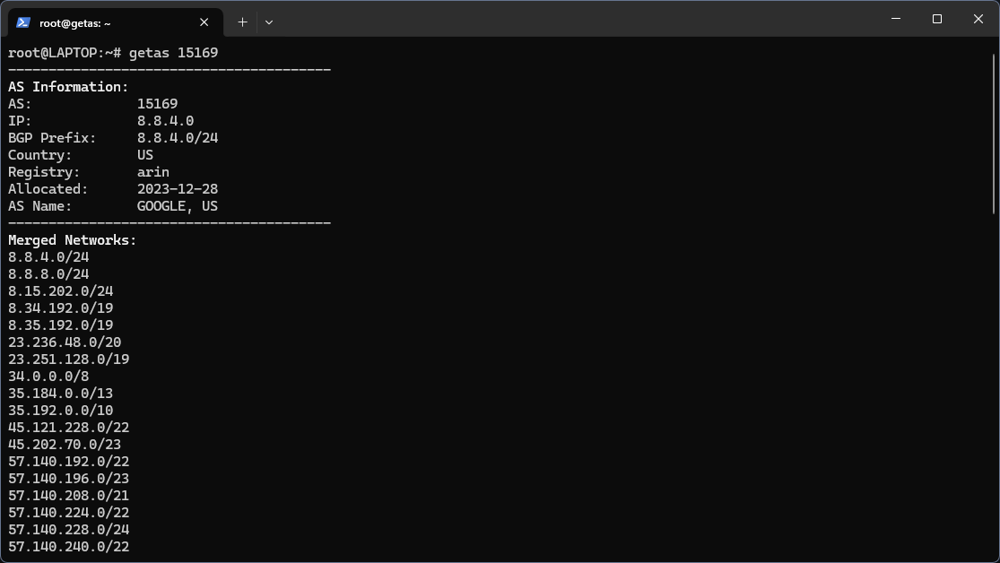
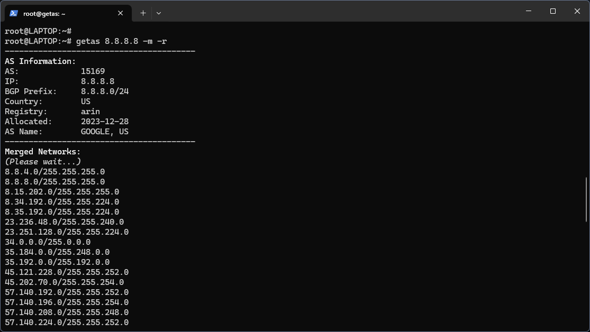

# getas — Retrieve AS information and routes


- [Installation](#installation)
- [Usage Examples](#usage-examples)
- [Using getas on Windows](#using-getas-on-windows)
- [Screenshots](#screenshots)
- [Русская версия](README_ru.md)

`getas` is a convenient tool for analyzing `Autonomous Systems` (AS) information, routes, and `network aggregation`. The script supports working with IP addresses, networks, domain names, or AS numbers. Its key features include retrieving detailed `AS` information, aggregating networks, and formatted output in both `English` and `Russian`.

This tool is designed for network engineers, analysts, and anyone interested in Internet route analysis.

*With many websites being blocked, up-to-date information about networks associated with various organizations has become particularly valuable. For example, to get a full list of networks associated with YouTube (Google), you only need to run:*
```
getas youtube.com -r
```


### Install dependencies

The script requires Python 3 and the whois command. Install them if they are not already available:

#### Debian/Ubuntu:
```
sudo apt update
sudo apt install python3 python3-pip whois
```

#### RHEL/CentOS:
```
sudo dnf install python3 python3-pip whois
```


### Install the script

To make the script easier to use, create a symbolic link:

```
sudo ln -s $(pwd)/getas.py /usr/local/bin/getas
```

Now you can run the script using the command `getas`.

### Recommended language configuration

By default, the script outputs information in English. To set Russian as the default language, add the following alias to your `.bashrc` file:

```
echo "alias getas='getas --lang ru'" >> ~/.bashrc source ~/.bashrc
```


---

## Usage Examples

### Retrieve AS information by AS number and advertised networks:

```
getas 15169
```

### Set a tolerance level for network aggregation:

```
getas 15169 --tolerance 8
```

### Prevent network aggregation:

```
getas 15169 --no-merge
```

### Retrieve AS information by IP address:

```
getas 8.8.8.8
```

### Retrieve AS information for an IP and its advertised networks:

```
getas 8.8.8.8 -r
```

### Convert subnet masks to binary format:

```
getas 8.8.8.8 -m -r
```

### Retrieve AS information using a domain name:

```
getas example.com
```

### Change output language:
```
getas mbarinov.ru -r --lang {ru,en}
```

### Help:

```
getas --help
getas help
```


---

## Using getas on Windows

To run the `getas.py` script on Windows, you need to set up Python and follow a few steps:

### Step 1. Install Python

- Download Python from the [official website](https://www.python.org/downloads/).
- Install `Python`, ensuring that the `Add Python to PATH` option is selected during installation.
- Verify the installation by running the following command in the Command Prompt:

```
python --version
```


### Step 2. Download the script

Download the `getas.py` script and save it in a convenient location, such as `C:\getas\`.

### Step 3. Run the script

#### To run the script, open the Command Prompt and follow these steps:

##### Navigate to the directory where `getas.py` is located. For example:


```
cd C:\getas
```

##### Execute the command to retrieve data. For example:

```
python getas.py youtube.com -r
```


### Step 4. Interpret the results

The script will return a list of networks associated with the specified domain (e.g., YouTube or Google). These results can be used for analysis or routing configuration.

### Tips for Windows usage

To simplify execution, you can create a shortcut or a batch file (.bat) with the following content:

```
@echo off
python C:\getas\getas.py %*
```

Save the file as `getas.bat`, and you can run it directly from the Command Prompt:

```
getas youtube.com -r
```

Now you can conveniently use `getas` on Windows.

---

## Screenshots






---

## Author

Mikhail Barinov

 - GitHub: https://github.com/mnbarinov

 - Website: https://mbarinov.ru


