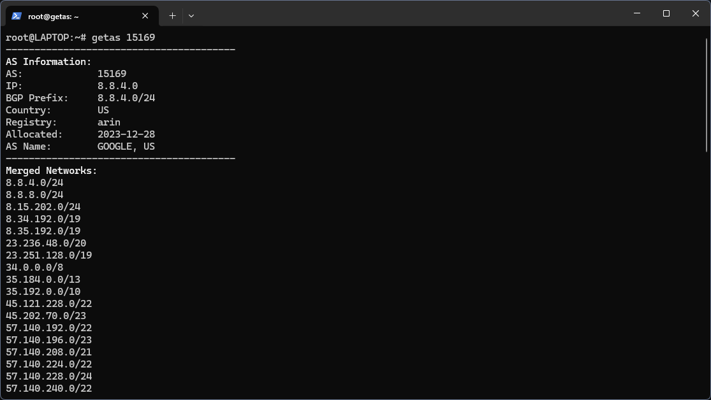
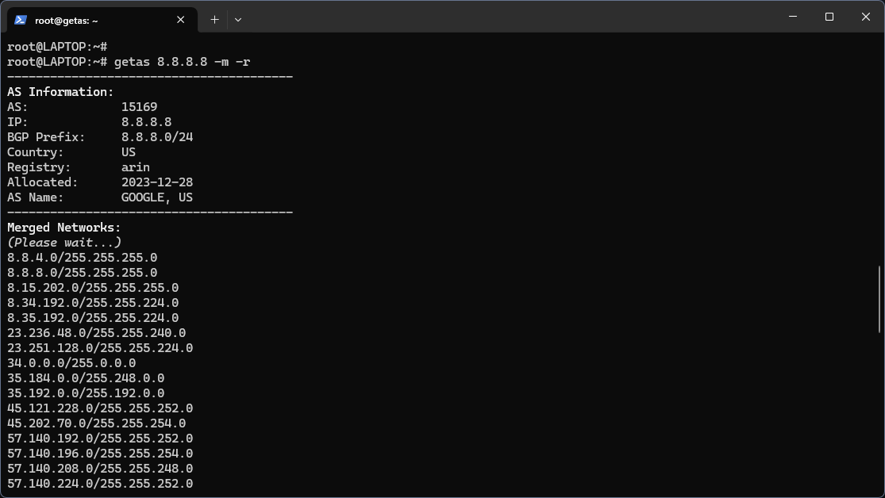
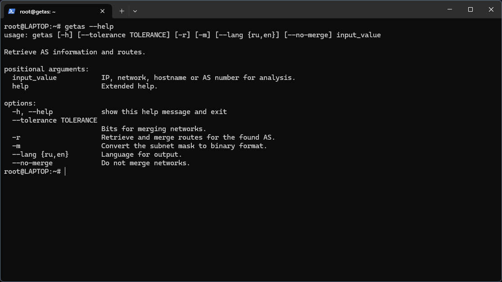

# getas — Retrieve AS information and routes


- [Установка](#установка)
- [Примеры использования](#примеры-использования)
- [Использование getas в Windows](#использование-getas-в-windows)
- [Снимки экрана](#снимки-экрана)
- [English](README.md)
  
`getas` — это удобный инструмент для анализа информации об `автономных системах` (AS), маршрутах и `объединении сетей`. Скрипт поддерживает работу как с IP-адресами и сетями, так и с доменными именами или номерами AS. Основные функции включают возможность получения детальной информации об `AS`, агрегацию сетей и форматированный вывод на `русском` и `английском` языках.

Этот инструмент разработан для сетевых инженеров, аналитиков и всех, кто интересуется анализом маршрутов в Интернете.

*Актуальные данные о сетях, связанных с различными организациями, стали особенно востребованными в условиях блокировки ряда сайтов. Например, чтобы получить полный список сетей, ассоциированных с YouTube (Google), достаточно выполнить следующую команду:*
```
getas youtube.com -r
```

## Установка
### Загрузка

#### Скачайте последнюю версию `getas` с `GitHub`:
```
git clone https://github.com/mnbarinov/getas.git
cd getas
```
### Установка зависимостей

Для работы скрипта требуются Python 3 и команды whois. Установите их, если они отсутствуют:

#### Debian/Ubuntu:
```
sudo apt update
sudo apt install python3 python3-pip whois
```

#### RHEL/CentOS:
```
sudo dnf install python3 python3-pip whois
```

### Установка скрипта

Для удобства использования создайте символическую ссылку:
```
sudo ln -s $(pwd)/getas.py /usr/local/bin/getas
```
Теперь вы можете запускать скрипт командой `getas`.

### Рекомендуемая настройка языка

По умолчанию вывод скрипта отображается на английском языке. Чтобы использовать русский язык по умолчанию, добавьте следующий алиас в свой файл `.bashrc`:
```
echo "alias getas='getas --lang ru'" >> ~/.bashrc
source ~/.bashrc
```

---

## Примеры использования

### Получение информации об автономной системе по номеру AS, и сетей анонсируемых AS:
```
getas 15169
```
### Задать допуск при объединении сетей:
```
getas 15169 --tolerance 8 
```
### Не объединять сети:
```
getas 15169 --no-merge
```
### Получение информации об автономной системе по IP-адресу:
```
getas 8.8.8.8
```
### Получение информации об автономной системе для IP и сетей анонсируемых AS:
```
getas 8.8.8.8 -r
```
### Преобразовать маски подсети в двоичный формат:
```
getas 8.8.8.8 -m -r
```
### Получение информации об автономной системе на основе доменного имени:
``
getas example.com
``
### Изменить язык вывода информации
```
getas mbarinov.ru -r --lang {ru,en}
```
### Справка:
```
getas --help
getas help
```

---


## Использование getas в Windows

Для запуска скрипта getas.py в Windows потребуется настроить Python и выполнить несколько шагов:
### Шаг 1. Установка Python

- Загрузите Python с [официального сайта](https://www.python.org/downloads/).
- Установите `Python`, выбрав опцию `Add Python to PATH` при установке.
- Проверьте установку, выполнив в командной строке:
```
python --version
```
### Шаг 2. Загрузка скрипта

Скачайте скрипт `getas.py` и сохраните его в удобном месте, например, в папке C:\getas\.

### Шаг 3. Запуск скрипта

#### Для запуска скрипта откройте Командную строку и выполните следующие действия:

##### Перейдите в директорию, где расположен `getas.py`. Например:
```
cd C:\getas
```
##### Выполните команду для получения данных. Например:
```
python getas.py youtube.com -r
```
### Шаг 4. Интерпретация результатов

Скрипт вернет список сетей, связанных с указанным доменом (например, YouTube или Google). Эти данные можно использовать для анализа и настройки маршрутизации.

### Советы по работе в Windows

Для удобства запуска можно создать ярлык для команды в PowerShell или сделать батник (.bat) с содержимым:
```
@echo off
python C:\getas\getas.py %*
```
Сохраните файл как getas.bat, и вы сможете запускать его напрямую из командной строки:
```
getas youtube.com -r
```
Теперь вы можете легко использовать `getas` в операционной системе Windows.


---

## Снимки экрана







---

## Автор

Михаил Баринов

 - GitHub: https://github.com/mnbarinov

 - Сайт: https://mbarinov.ru


